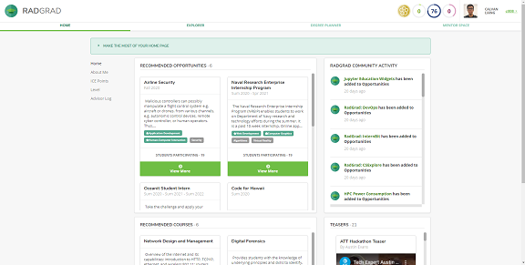

  

When I entered the University of Hawaii at Manoa during the Fall Semester of 2017 as a computer science major, I was woefully unprepared for how different the college course system was from the high school course system. In high school, registering and planning courses properly to work towards graduation was, for the lack of a better term, basic. High school students simply had to choose seven classes every year for four years. These seven courses usually consist of a math, science, english, and history course. The rest are electives. It is a completely new ballpark when regarding the selection of college courses. I remember being completely bewildered by the concept that every semester or year is not standardized with the requirement of having a math, science, english, and history course. STAR GPS, the website University of Hawaii students use to plan and register for courses, confused my understanding of course structure and scheduling. Various questions buzzed through my mind. What does FW, FG, DA, DH, DL, DS, DB courses mean? Which ones am I required to do? What are lower and upper division courses? Do I still have to choose a math, reading, science, and history class every semester or year?

In my first year as a college student, I frantically took as many general education requirements as I could. I started fulfilling all my general education requirements, but I had little to no idea on what courses were to come for computer science. There are so many different ICS (Information and Computer Science) courses and I did not know which ones to take that best fits my interests. When I finally discovered RadGrad through my ICS 314 course, the fog, which was obscuring my college pathway vision, finally started to dissipate. I was able to easily view different academic plans and read more in-depth descriptions about every ICS course. Using the explorer, I was able to find opportunities and activities related to computer science that I never knew existed. The aspect of RadGrad that got me the most intrigued is how it suggests specific courses to take when a student wants to work towards a certain career goal. That feature is something I desired since the beginning of my college experience.

Re-exploring RadGrad, I was pleased to find useful features that I never noticed before. When updating my profile, I never realized that RadGrad makes suggestions for interests based on my career goals. Although I generally know what sort of career I want to work towards, these suggestions for interests helped me narrow down what concepts and skills I need to provide more focus upon. The videos on the front page of RadGrad are a great resource that I did not notice before. While updating my degree planner, I was glad I watched the video about verification requests. I did not receive any points in innovation and experience, because some of my activities were not verified. I now properly requested for verification and will hopefully move to the next level in the near future.

Looking at the mentor space and its functionality of enabling students to get their questions answered by mentors, I also think that a place on RadGrad that allows students to converse with each other would be useful and beneficial. Implementing something forum-like on RadGrad can assist in making the ICS community feel a bit more connected since students can discuss their experience with various courses, events or opportunities. I always found feedback from other students’ experience with certain courses to be extremely helpful. To make the RadGrad degree planner a little easier to use, I would suggest changing how courses are found and added to it. I found it a little frustrating that when I was modifying my degree planner, I cannot directly search for courses or opportunities on the degree planner page. I had to go to the explorer, find the specific course or opportunity, favorite it, go back to the degree planner, and then I would be able to add it. Although it is not entirely perfected as of right now, RadGrad is a great tool for students to map out their college course pathway. It will undoubtedly prove useful for many future computer science students.
