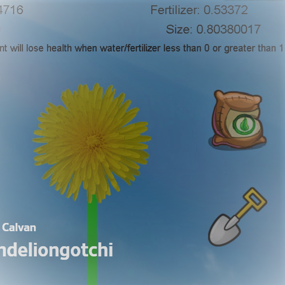

Dandeliongotchi is a clicker game based on the once popular Tamagotchi. It is a solo project assigned in ICS 111. The project helped me learn how to manage and manipulate the values of multiple variables as time passes.

Dandeliongotchi is created using a Java integrated development environment (IDE) called Eclipse. This was a solo project, so I had to manage it myself. Within two to three days, I had a working prototype where values of variables change over time and could be changed by the player.

When I finished this project, I understood how to manipulate values over time, create an area of collision (detection of the mouse clicking on a picture), and code graphics in Java. I also familiarized myself and gained experience with Eclipse.

Video Demonstration: <a href="https://www.dailymotion.com/video/x61vpuf">Dandeliongotchi</a>

(I no longer have access to the code, so no source code is available.)
