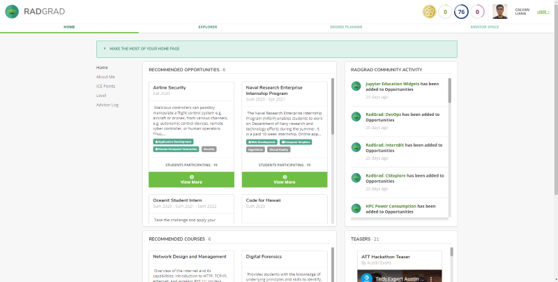
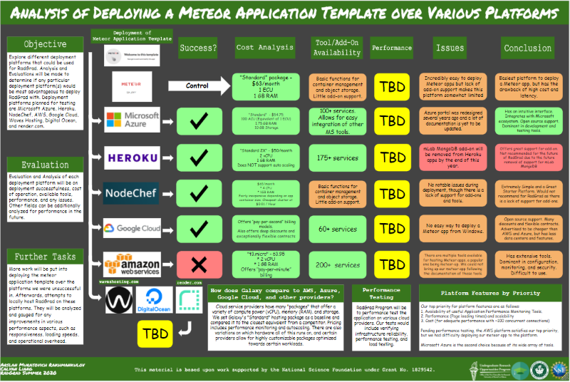

RadGrad is a project that intends to improve and aid students in their STEM career path. It helps students and aspiring STEM specialists by guiding them through their degree program and presenting them post-graduate opportunities. 

The purpose of this research project is to decide on an alternative hosting platform for RadGrad. Currently, RadGrad is hosted on Galaxy, which is a Meteor specific hosting platform that allows for easy deployment and monitoring of Meteor apps. For those unfamiliar, Meteor is a framework for developing applications.
The drawbacks are that it is pricey and its servers are on the East coast, which causes high latency. I worked on this research project with another person as a two-man team.

Through research and deployments to various cloud service providers, we believe we found a platform to meet our needs and move the project forward.

Our needs are as follows, in order of importance
1. There must be an Availability of useful Application Performance Monitoring Tools.
2. Must have Great performance and scalability
3. Have Minimal cost for adequate performance with ~100 concurrent connections)

Here is what we discovered about the following platforms.

Meteor/Galaxy was our control, and we used their standard for comparison to everything else. Easy deployment, but high cost and high latency.

Microsoft Azure was relatively easy to set up and deploy. Their portal was recently redesigned so some of the documentation is outdated and things have moved around, but it is still very usable. There is a decent amount of services available, a lot of monitoring tools, and support for open source software. It also supports the Microsoft ecosystem. 

Heroku Easy deployment. Lot of additional services, but most are 3rd party and are not developed by Heroku. Although it may be a great choice for other web stacks, it does not have any free monitoring tools for a meteor app that we could find. Other platforms host them for free and are directly responsible for their development. However, mLab MongoDB add-on will be removed from Heroku apps by the end of this year. Due to this future removal, this hosting platform is not recommended for the future of RadGrad. 

NodeChef Easy deployment with no notable issues. However, there is a lack of support for add-ons and tools. There are not many features beyond basic functions for container management and object storage. The simplicity makes it a great starter platform, but it is not likely or recommended to use this platform for the hosting of RadGrad due to the lack of support for add-ons and features. 

Google Cloud was some trouble to set up, as the only meteor package that sets it up for you did not work on Windows. Once we found a workaround, the deployment was really simple. The GCP tries to stand out by offering low rates and various discounts relative to AWS and Azure. This platform is not as developed as AWS or Azure, featuring the least features and datacenters. Fairly great support for open source.

AWS is the oldest player in the game, predating Azure and GCP by about 5 years. It has the most features and highly customizable pricing for specialized workloads. It is the dominant player in configuration, monitoring, and security. We were not able to deploy our Meteor app to AWS following the documentation of meteor-up, which is a popular deployment package. It is worth noting that setting up the infrastructure is a one time deal and may be worth it to spend additional time researching this because it may save a lot of money in the long run.

Pricing. 

Cloud service providers have many "packages" that offer a variety of compute power, memory, and storage. We set Galaxy's "Standard" hosting package as a baseline and compared it to the closest equivalent offer from a competitor.
There are also variations on which hardware all of this runs on, and certain providers allow for highly customizable packages optimized towards certain workloads. One issue here is that cloud providers have variations in how they describe their CPU performance, with AWS referring to it as vCPU, Galaxy has ECUs, and Azure measures it with ACUs. One way to analyze true performance is with stress testing, but that has its own issues. Stress testing is the future goal for this project.

I’ll take over after that paragraph

Stress testing faces its own set of challenges. To stress test a site, we must put a load on it, simulating many users logging onto the site. The problem here is that many hosting platforms have DDOS (distributed denial of service) attack prevention methods, which may counteract our testing methods. One other option is to go to an independant website that could perform these tests for you on certain platforms, but they will face the same issue. To counteract this they reveal themselves to the host and the host removes certain security measures. We should be weary of using this data as it is no longer the same environment that active users will experience.

Finally, to answer our research topic, pending performance testing, the AWS platform satisfies our top priority and Microsoft Azure is the second choice because of its wide array of tools.

Answers to General Questions
Q: This project does not seem fully complete. What are your future plans for this project?
A: We will put more work into deploying the meteor application template over the platforms we were unsuccessful with. Work will then be done to locally host RadGrad on these platforms. Each of them will then be analyzed and gauged for any improvements in various performance aspects, such as responsiveness, loading speeds, overall cost, and operational overhead

Q: I see that everything under performance is “TBD.” What will be done for performance testing?
A: As of right now, we do not have the exact specifications on what we will be using to measure performance. However, we would be looking at things such as infrastructure reliability, performance testing, and load testing. We will also be analyzing the costs of operation for each hosting platform. This can be done by calculating the cost of a week-long trial run of each platform.
