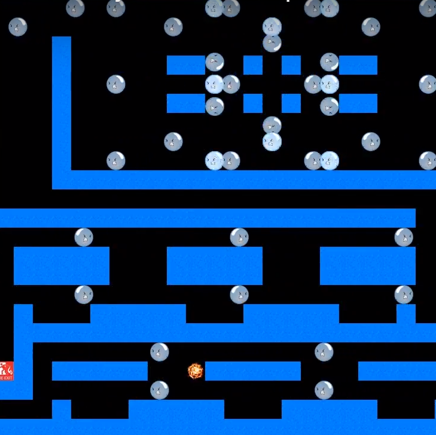
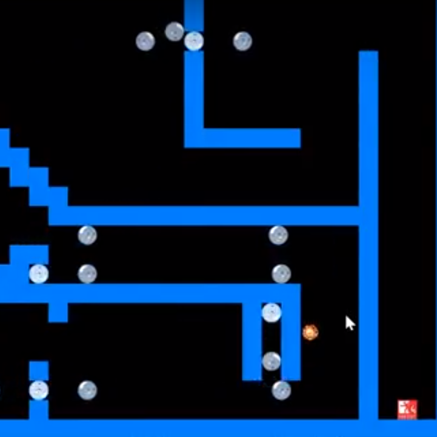
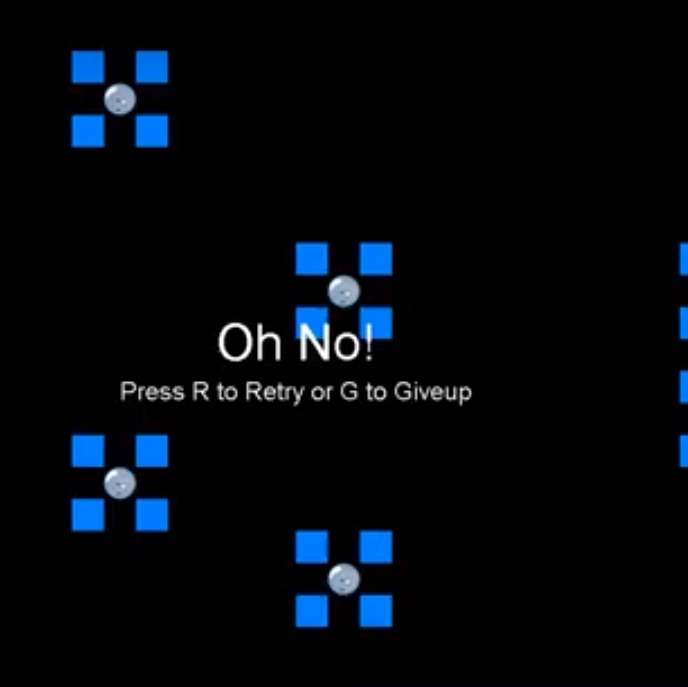

This ICS 111 project required everyone to create their own miniature game. I created Fire Escape. Fire Escape is a game where a fire sprite tries to literally escape. The player controls the fire sprite using arrow keys. There are aggressive bubbles blocking the path to the fire escape. The player can win if he or she successfully dodges all the bubbles and reach the fire escape. There are three levels of increasing difficulty.  

Fire Escape is created using a Java integrated development environment (IDE) called Eclipse. In this project, I partnered with a classmate named Nicholas Shiroma. I was responsible for coding the Player and FileRead class. Nicholas Shiroma put those classes to use in the Main class. I made some adjustments to his code to ensure Fire Escape runs properly. I designed the first and third level of Fire Escape. Nicholas designed the second level. Thus, we each did not have a specific role. We did what we can to get Fire Escape working and done. We worked together often to ensure the code we wrote will work when put together. 

When the project was finished, I learned how to change the .txt file being accessed without re-running or re-compiling (such as when the player moves to different level), keep track and detect collisions of many entities, and create a simple interface for the player to use (menu, level select, restart, etc).

Video Demonstration: <a href="https://www.youtube.com/watch?v=asvaF2X6ECw&t=105s">Fire Escape</a>

(I no longer have access to the code, so no source code is available.)
