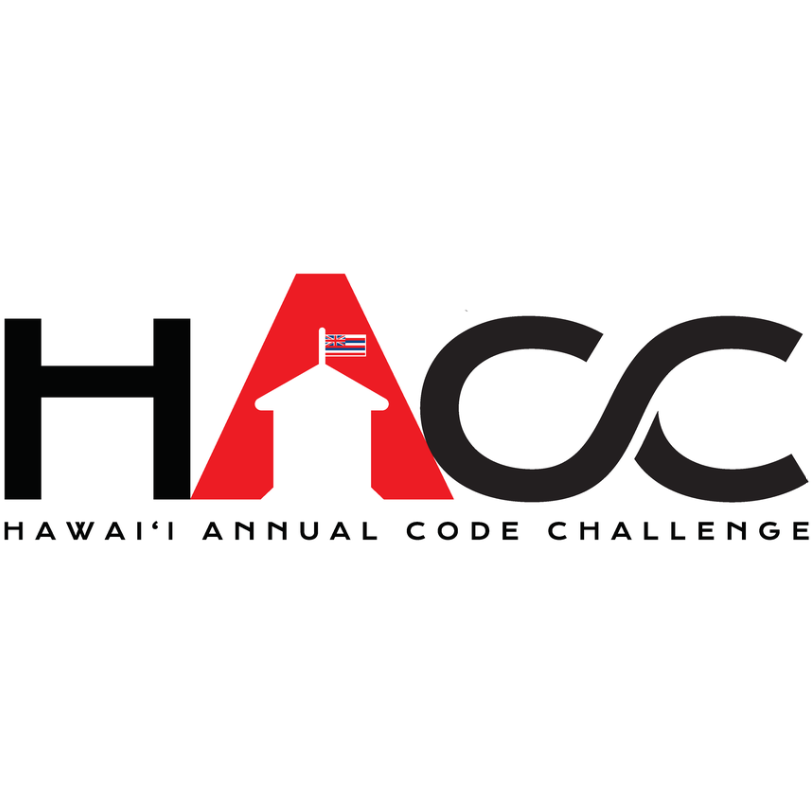
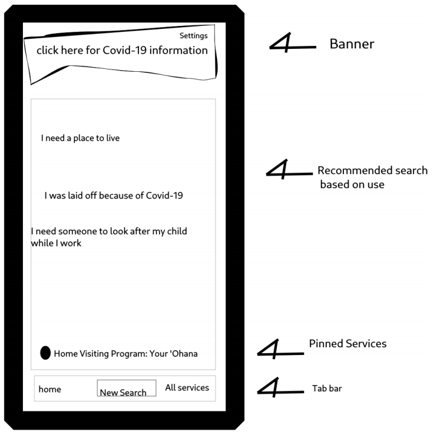

## Quick Introduction

Helping Hands is a Hawaii State Resource Directory Application that was developed by a five member team called HACCsgiving for the 2020 Hawaii Annual Code Challenge (HACC). It is intended to help users who need assistance in things such as housing, food, and medical. Users can quickly go on the application and find what exactly what they need in mere seconds, rather than going through a painstaking hunt through various directories on the internet. 

## The 2020 Hawaii Annual Code Challenge (HACC)

The 2020 Hawaii Annual Code Challenge (HACC) is a competition where participants use their knowledge, skills, and creativity to design an useful application that would benefit the people of Hawaii in some way. Several challenge prompts were presented to the participants to choose from. In teams, participants design and implement their application over roughly three to four weeks. After the first week or so, each team will present what they have implemeted so far to a panel of tehcnical judges and earn points. If the team receives enough points, they will be selected to present their final product in the final presentation. In the final presentation, the applications will be judged by another panel of judges for final scoring. However, unlike the previous years where such presentations would occur in-person, the 2020 HACC was completely virtual. This was due to the COVID-19 pandemic. To keep everyone safe, everyone can stay distanced at home and attend the virtual HACC on a video conferencing platform called **[Zoom](https://zoom.us)**. More information about HACC can be found **[here](https://hacc.hawaii.gov/)**.

## HACCsgiving

My HACC team is comprised of five people. They are **[Kegan Flagg](https://github.com/LukewarmCoffee), [Christopher Na](https://github.com/chrisjna), [Graham Francisco](https://github.com/gbfrancisco), [Micah Kim](https://github.com/kimmicah)** and myself, **[Calvan Liang](https://github.com/calvan-liang)**. We chose the pun of a name "HACCsgiving" because the final presentation takes place a few days before Thanksgiving and the "giving" part somewhat relates to the challenge we chose to develop an mobile application for. 

## The Hawaii State Resource Directory Challenge

The challenge that my team and I chose is in need of an index that lists various available assistive resources in Hawaii. Resources include things such as health insurance, housing assitance programs, and food assistance programs. This resource index can be accessed through an mobile application, where users can quickly find whatever assistance they require. This challenge is given by First Lady Dawn Amano-Ige. More information about the Hawaii State Resource Directory Challenge can be found **[here](https://hacc.hawaii.gov/wp-content/uploads/2020/10/Challenge_2020_ResourceDirectory.pdf)**.

## The Process

As a virtual team project, the absolute first thing the team has to establish is communication. We decided to use **[Discord](https://discord.com/)**. Discord is a platform where users can join a "server" and send messages in text channels, make voice calls, make video calls, send files, and send links within that server. Such a multipurpose platform is perfect for what we required.

The process for planning the Helping Hands mobile application was rather chaotic. This may be due to our inexperience in working on a project that is solely virtual. We did several voice call conferences, but it was difficult to convey and express our ideas through words only. Imagine trying to describe how an application would exactly look and function solely in words. We eventually conjured up a general idea and a team member was able to scribble out a mockup. Although it is extremely rough, this mockup was the thing we needed to set our plan in motion. 

For the framework, we chose to use **[React-Native](https://reactnative.dev/)**. React-Native was chosen because most of our team members already have some experience with the **[React](https://reactjs.org/)** Javacript Library. We also needed a back-end service that gives us the ability to store things in a database and do authentication for user log-in purposes. Firebase, a service developed by Google, fulfilled that purpose sufficiently.

Unfortunately, the implementation of the Helping Hands mobile application was about as chaotic as the planning. We did not really have any sort of a system, technique, or procedure for our work progression. The roadmap was essentially the start, a blur of progress, and the final product. However, we were able to inch towards the goal since we frequently communicated with each other through Discord and established what we had to get done. Graham, Micah, and I worked on the front-end. We implemented various pages of the application and ensured they were functioning properly. The other two members, Chris and Kegan, focused on implemented Firebase for the back-end.

## The Helping Hands Application

Here are the team's **[Devpost](https://devpost.com/software/helping-hands-o96srp)** and **[GitHub](https://github.com/HACC2020/HACCsgiving)**

## The Good, the Bad, and the Future
