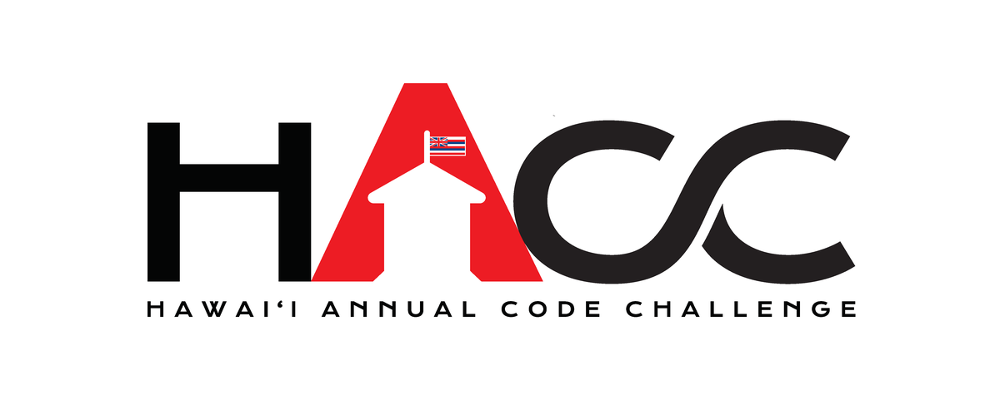
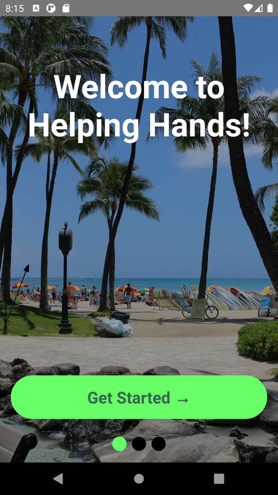
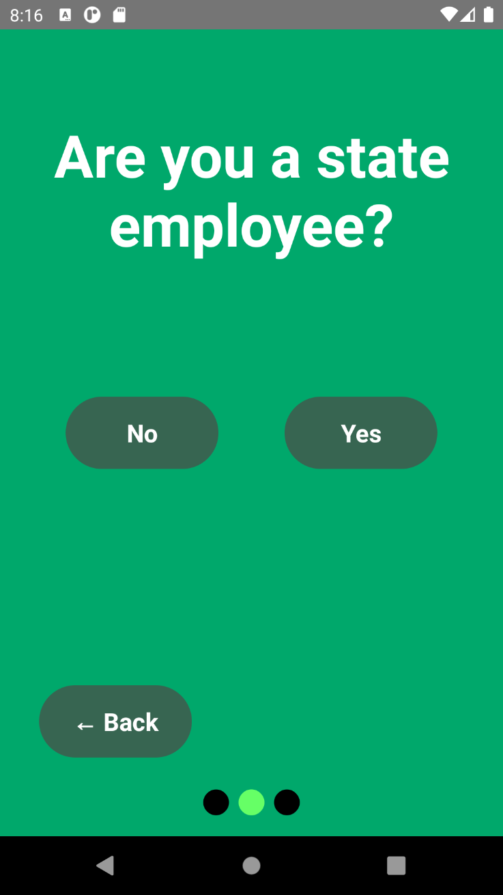
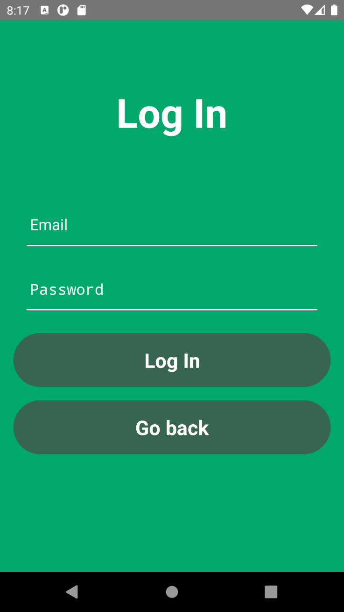
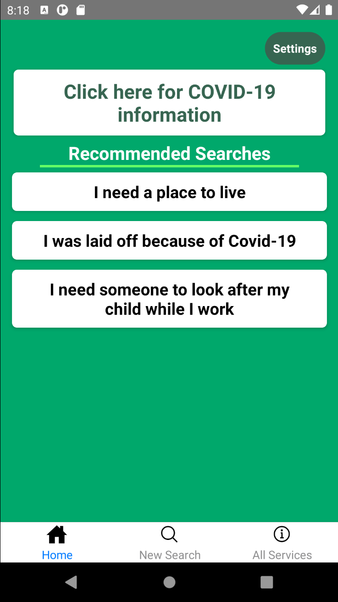
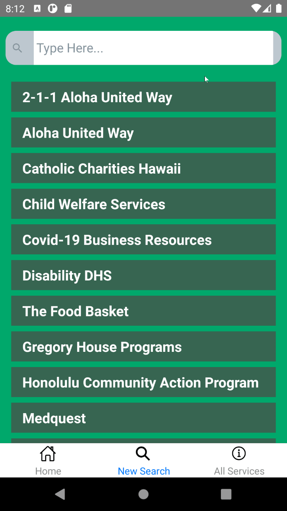
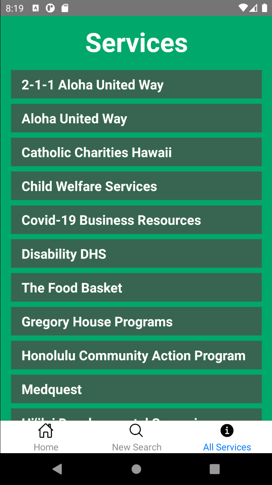

## Quick Introduction

Helping Hands is a Hawaii State Resource Directory Application that was developed by a five member team called HACCsgiving for the 2020 Hawaii Annual Code Challenge (HACC). It is intended to help users who need assistance in things such as housing, food, and medical. Users can quickly go on the application and find what exactly what they need in mere seconds, rather than going through a painstaking hunt through various directories on the internet. 

## The 2020 Hawaii Annual Code Challenge (HACC)

The 2020 Hawaii Annual Code Challenge (HACC) is a competition where participants use their knowledge, skills, and creativity to design a useful application that would benefit the people of Hawaii in some way. Several challenge prompts were presented to the participants to choose from. In teams, participants design and implement their application over roughly three to four weeks. After the first week or so, each team will present what they have implemented so far to a panel of technical judges and earn points. If the team receives enough points, they will be selected to present their final product in the final presentation. In the final presentation, the applications will be judged by another panel of judges for final scoring. However, unlike the previous years where such presentations would occur in person, the 2020 HACC was completely virtual. This was due to the COVID-19 pandemic. To keep everyone safe, everyone can stay distanced at home and attend the virtual HACC on a video conferencing platform called **[Zoom](https://zoom.us)**. More information about HACC can be found **[here](https://hacc.hawaii.gov/)**.

## The Hawaii State Resource Directory Challenge

The challenge that my team and I chose is in need of an index that lists various available assistive resources in Hawaii. Resources include things such as health insurance, housing assistance programs and food assistance programs. This resource index can be accessed through a mobile application, where users can quickly find whatever assistance they require. This challenge is given by First Lady Dawn Amano-Ige. More information about the Hawaii State Resource Directory Challenge can be found **[here](https://hacc.hawaii.gov/wp-content/uploads/2020/10/Challenge_2020_ResourceDirectory.pdf)**.

## The HACCsgiving team

My HACC team is comprised of five people. They are **[Kegan Flagg](https://github.com/LukewarmCoffee), [Christopher Na](https://github.com/chrisjna), [Graham Francisco](https://github.com/gbfrancisco), [Micah Kim](https://github.com/kimmicah)** and myself, **[Calvan Liang](https://github.com/calvan-liang)**. We chose the pun of a name "HACCsgiving" because the final presentation takes place a few days before Thanksgiving and the "giving" part somewhat relates to the Hawaii State Resource Directory Challenge. 

## The Process

As a virtual team project, the absolute first thing the team has to establish is communication. We decided to use **[Discord](https://discord.com/)**. Discord is a platform where users can join a "server" and send messages in text channels, make voice calls, make video calls, send files and send links within that server. Such a multipurpose platform is perfect for what we required.

The process for planning the Helping Hands mobile application was rather chaotic. This may be due to our inexperience in working on a project that is solely virtual. We did several voice call conferences, but it was difficult to convey and express our ideas through words only. Imagine trying to describe how an application would exactly look and function solely in words. We eventually conjured up a general idea, and a team member was able to scribble out a mockup. Although it is extremely rough, this mockup was the thing we needed to set our plan in motion. 

For the framework, we chose to use **[React-Native](https://reactnative.dev/)**. React-Native was chosen because most of our team members already have some experience with the **[React](https://reactjs.org/)** Javacript Library. We also needed a back-end service that gives us the ability to store things in a database and do authentication for user log-in purposes. Firebase, a service developed by Google, fulfilled that purpose sufficiently.

Unfortunately, the implementation of the Helping Hands mobile application was about as chaotic as the planning. We did not really have any sort of a system, technique or procedure for our work progression. The roadmap was essentially the start, a blur of progress, and the final product. However, we were able to inch towards the goal since we frequently communicated with each other through Discord and established what we had to get done. Graham, Micah, and I worked on the front-end. We implemented various pages of the application and ensured they were functioning properly. The other two members, Chris and Kegan, focused on implemented Firebase for the back-end.

## The Helping Hands Application

The Helping Hands Application is very straightforward and exactly what it is intended to be. An entire list of services is contained in a database. The search filters through all the services until only the related services that the user is interested in are left. Hypothetically, users can download this application on their phone and search up information or assistance they need within a minute.

#### Landing

Opening the Helping Hands Application, this is the initial screen that the users see.

#### State Employee?
After the landing screen, the application asks if the user is a state employee. The user is directed to the login screen if "yes" is selected. Otherwise, selecting "no" will direct the user to the "splash" page.

#### Login

After selecting "yes" on the previous screen, the user, presumably a state employee, can log in.

#### Splash Page

The splash page is sort of the main "hub" of the application. One of the recommended searches can be selected to quickly direct users to what they need. At the bottom, the user can select one of the tabs to either search for the service they require or view the entire list of services. 

#### Search

The search enables users to search for services they need using keywords. Clicking on one of the services will direct the user to a card with information about the service they selected and a link to the appropriate website.

#### List of All Services

This has a list of all the services on the app.

#### Video Demonstration
Here is a quick video demonstration that Kegan created. It exhibits Helping Hand's functionality.

<iframe width="690" height="445" src="https://www.youtube.com/embed/pmVGrtbvdLk" frameborder="0" allow="accelerometer; autoplay; clipboard-write; encrypted-media; gyroscope; picture-in-picture" allowfullscreen></iframe>

Here are the team's **[Devpost](https://devpost.com/software/helping-hands-o96srp)** and **[GitHub](https://github.com/HACC2020/HACCsgiving)**

## The Good, the Bad, and the Future

Despite the chaotic planning and progression, I am proud that my team and I were able to create the Helping Hands application. We were able to keep on track and trudged onward to create a fairly decent application that served the role we initially intended. Although difficult to convey what each of us exactly wanted to implement, we communicated frequently and worked through what needed to be done. We were able to successfully obtain a finished product that was very user-friendly and a great tool for those in need of information or assistance. 

Our workflow was messy and horrendous. No short term goals were planned and the direction of progress was all over the place. Perhaps someone should have stepped up and took charge of organizing what needed to be done. Everyone sort of blanked on the idea of organizing our work and wanted to get straight to implementing their ideas. We also sort of assigned ourselves our own roles. It is was not clear what everyone was doing exactly. Some of our communications were not about what to do next, but rather what we're doing and what to avoid so that our merges on Github would not conflict each other. 

HACC taught me a lot about working as a team in a solely virtual environment. It is vital for us to have a plan, though not in the way we think. Our biggest failure was the planning, but not having a plan on how to do the planning. We sort of just threw ideas around without a clear unified goal in mind. We only initially started to cover ground towards the finished product when a rough mockup is scribbled up. This clearly shows that having a plan is not the most important first step. It is how we arrive to a plan. We have to learn some sort of methodology or template for creating a plan.

After working more with the React-Native framework, I have to say that it did not feel satisfying. What we could do with the library turned out well, but it feels rather limited. Outside of the basics, creating more complex and pleasing to the eye components do not seem possible. The user interface is solid and easy to use but it seems rather static. There is little that can be done to make the application seems more "animated."

If I were to develop another mobile application in the future, I would definitely ensure to come up with a plan for planning and progressing earlier. I will look up templates and methodologies beforehand to better prepare myself and the team. I would like to avoid working chaotically without clear short-term goals in mind. It would be ideal to progress in a more timely and planned manner. I am interested in trying out other frameworks such as Flutter. Many other teams opted to use Flutter and it was surprising that very few teams used React-Native. Flutter has piqued my interest, and I will absolutely try it out in the future.

My overall first experience with HACC was rough but very important. It allowed me to understand the importance of proper preparation, communication, and workflow. It has exposed me to the harsh truth of how a poorly managed and disorganized team will trundle towards some unclear (short-term) goal. I am now more aware of what it means to work as a team virtually and what needs to be done to obtain the final product efficiently, effectively, and timely. 
