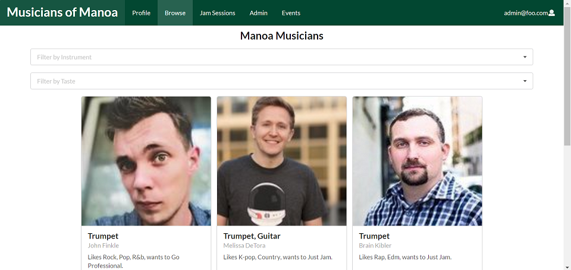

The purpose of the Musicians of Manoa application is to allow musicians in Manoa to meet other musicans and hold jam sessions. A user can sign up and log into their profile. After logging in, the user can edit their profile to express their musical capabilities, musical taste, contact information, etc. There is a page where the user can browse other musicians, which enables the user to find other musicans to perform or socialize with. To narrow down the user's search for people of same interest or taste, there are dropdowns where the user can select an intrument or genre of music. Additionally, while browsing through the profiles, the user can give each Musician a rating if they choose to do so. The Jam Sessions page displays events where people can attend to jam out with other musicians. All in all, this application intends to be simple and straighforward way for musicans to meet other musicians in Manoa.

