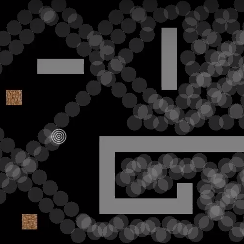

Roombrah is a simulation of a cleaning robot from the top-down view. The walls represent the interior of a wacky house. As expected, it is based on the autonomous vacuum cleaner called Roomba. This simulates a more primitive autonomous vacuum cleaner called Roombrah.

Roombrah is created using a Java integrated development environment (IDE) called Eclipse. This was a solo ICS 111 project, so I managed this project by myself. Within two days, I had a working prototype. The "roombrah" was able to collide and bounce off walls, deleting dirt that it collides into.

When I finished this project, I understood how to implement a seperate class into my Main class, create moving entities, read a file, and detect collisions between entities. I also gained a deeper understanding of Java classes and graphics.

Video Demonstration: <a href="https://www.youtube.com/watch?v=t_EQsXMiV7o&t=26s">Roombrah</a>

(I no longer have access to the code, so no source code is available.)
